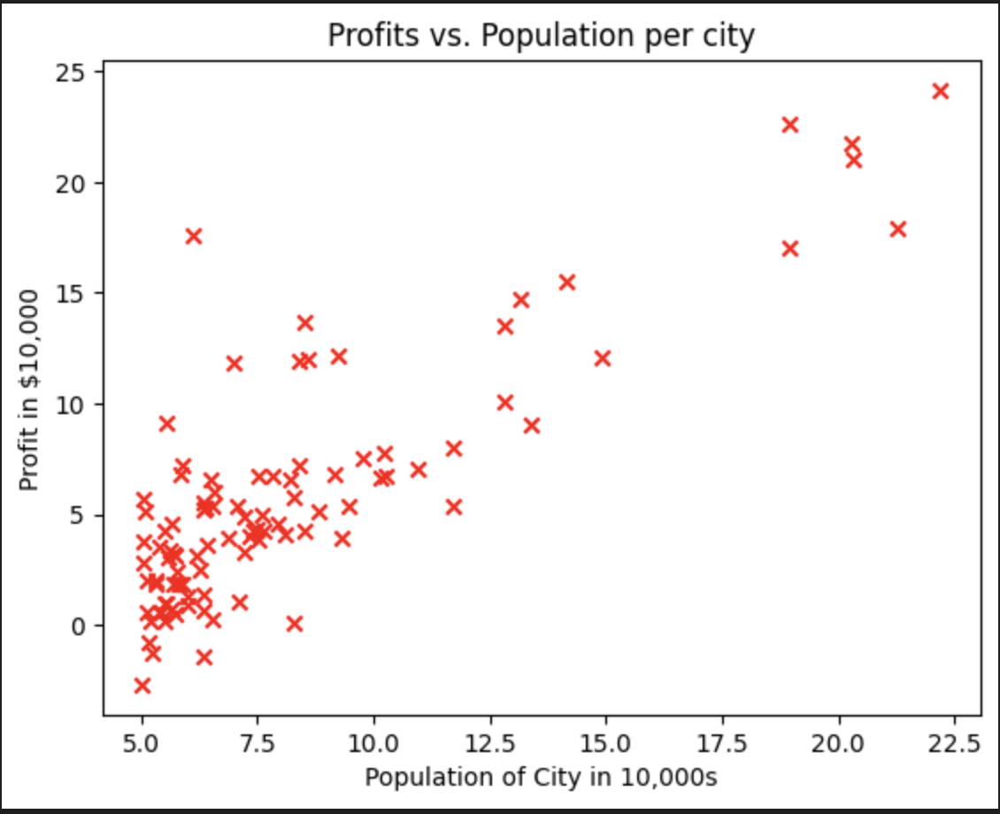
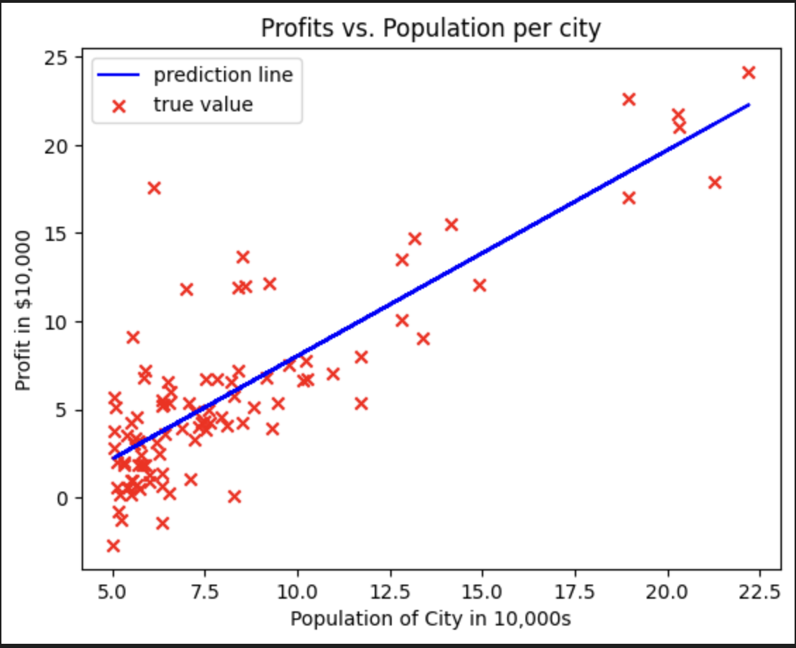

# Restaurant Franchise Profit Prediction

## Introduction
Welcome to the Restaurant Franchise Profit Prediction project! This project was completed as a part of the Supervised Learning course in the Machine Learning Specialization by Stanford University on Coursera. The aim of this project is to predict the profit from opening a restaurant franchise on a particular city based on population of that city.

In this repository, you will find the code and resources used for building and evaluating the prediction model.

## Dataset
The dataset used for this project can be found in the `data` directory.

## Installation
To run the code in this repository, you'll need to have Python and several libraries installed. You can set up the environment by following these steps:

1. Clone this repository to your local machine using `git clone https://github.com/ShishirRijal/Resturant-Franchise-Profit-Prediction.git`
2. Navigate to the project directory: `cd Resturant-Franchise-Profit-Prediction`
3. Install the required libraries using pip:

## Usage
To use this project, follow these steps:

1. Ensure you have set up the environment as described in the installation section.
2. Open and run the Jupyter notebook `Restaurant_Profit_Prediction.ipynb`.
3. Follow the notebook's instructions to load the dataset, preprocess the data, build and evaluate the prediction model.
4. You can also use the trained model to make predictions on new data by modifying the input variables.

## Visualization

